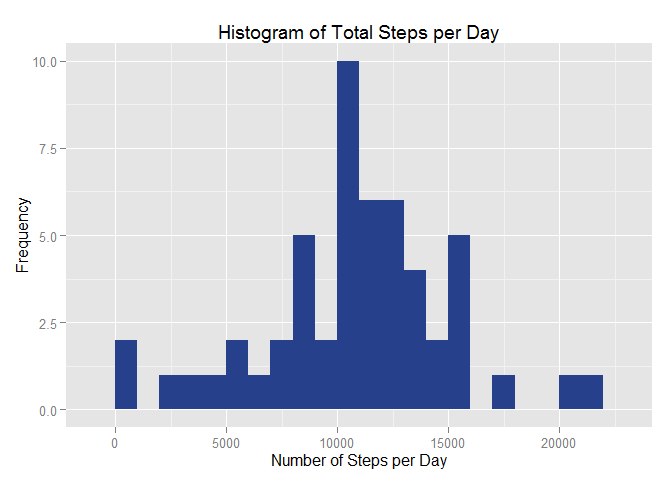
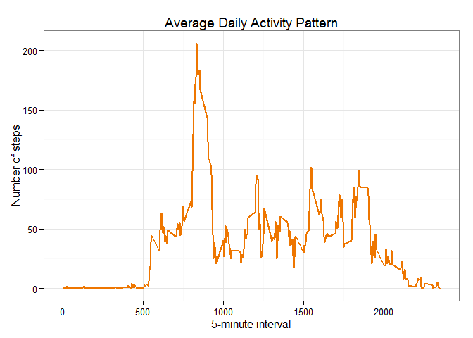
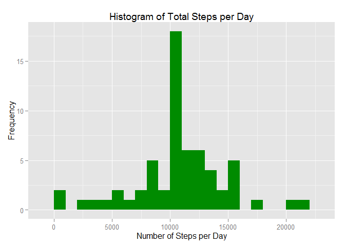
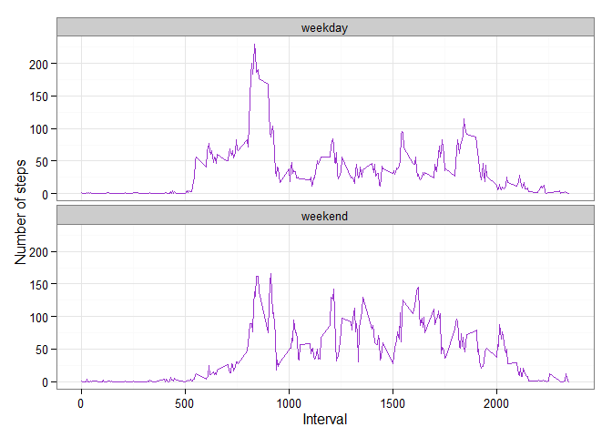

# Reproducible Research: Peer Assessment 1
### Loading and preprocessing the data

**1. Load required libraries**


```r
library(ggplot2)
```

**2. Load data**


```r
## Unzip and read data
unzip ("activity.zip", exdir = "./data")
activity = read.csv("./data/activity.csv", header=TRUE, na.strings="NA", colClasses = c("integer", "Date", "factor"))
## Display first 6 records of the data set
head(activity)
```

```
##   steps       date interval
## 1    NA 2012-10-01        0
## 2    NA 2012-10-01        5
## 3    NA 2012-10-01       10
## 4    NA 2012-10-01       15
## 5    NA 2012-10-01       20
## 6    NA 2012-10-01       25
```

### What is mean total number of steps taken per day?

**1. Calculate the total number of steps taken per day**


```r
## Calculate total steps per day ignoring NA values
totalStepsPerDay = aggregate(steps ~ date, data = activity, sum, na.rm = TRUE)
```

**2. Make a histogram of the total number of steps taken each day**


```r
ggplot(totalStepsPerDay, aes(x = steps)) + 
        geom_histogram(fill = "royalblue4", binwidth = 1000) + 
        labs(title="Histogram of Total Steps per Day", 
             x = "Number of Steps per Day", y = "Frequency") 
```

 

**3. Calculate and report the mean and median of the total number of steps taken per day**


```r
mean(totalStepsPerDay$steps)
median(totalStepsPerDay$steps)
```

The *mean* is 10766.19 and the *median* 10765. 

### What is the average daily activity pattern?

**1. Make a time series plot of the 5-minute interval (x-axis) and the average number of steps taken, averaged across all days (y-axis).**


```r
avgSteps <- aggregate(activity$steps, list(interval = as.numeric(as.character(activity$interval))), FUN = "mean",na.rm = TRUE)
names(avgSteps)[2] = "meanSteps"

## Plot the 5 minunute interval
ggplot(avgSteps, aes(x=interval, y=meanSteps)) +   
        geom_line(color="darkorange2", size=1) +  
        labs(title="Average Daily Activity Pattern", 
             x="5-minute interval", y="Number of steps") +  
        theme_bw()
```

 

**2. Which 5-minute interval, on average across all the days in the dataset, contains the maximum number of steps?**


```r
avgSteps[which.max(avgSteps$meanSteps),]
```

```
##     interval meanSteps
## 104      835  206.1698
```

### Imputing missing values

**1. Calculate and report the total number of missing values in the dataset:**

The presence of missing values can introduce bias into some calculations or summaries of the data. 

The total number of missing values is **2304**.


```r
sum(is.na(activity))
```

**2. Filling all of the missing values in the dataset:**

we replace the NA values by the mean across all days for the 5-minute interval which the NA occurs.


```r
newActivity <- activity
for (i in 1:nrow(newActivity)) {
        if (is.na(newActivity$steps[i])) {
                newActivity$steps[i] = avgSteps[which(newActivity$interval[i] == avgSteps$interval), ]$meanSteps
        }
}
```

We check that we removed all missing values:


```r
sum(is.na(newActivity))
```

```
## [1] 0
```

Zero means that there are ***no missing values***.

**3. Make a histogram of the total number of steps taken each day and Calculate and report the mean and median total number of steps taken per day**


```r
## Calculate total steps per day
newTotalStepsPerDay = aggregate(steps ~ date, data = newActivity, sum, na.rm = FALSE)
## Create a histogram with the total steps per day
ggplot(newTotalStepsPerDay, aes(x = steps)) + 
        geom_histogram(fill = "green4", binwidth = 1000) + 
        labs(title="Histogram of Total Steps per Day", 
             x = "Number of Steps per Day", y = "Frequency") 
```

 


```r
mean(newTotalStepsPerDay$steps)
median(newTotalStepsPerDay$steps)
```

The **mean** is 10766.19 and the **median** 10766.19. 

As you can see, the mean and median of the total number of steps is the same and while the mean value remains the same, the median value has shifted to the mean as per below:

**Before filling the data:**

- Mean: 10766.19
- Median: 10765

**After filling the data:**

- Mean: 10766.19
- Median: 10766.19

### Are there differences in activity patterns between weekdays and weekends?

**1. Create a new factor variable in the dataset with two levels -- "weekday" and "weekend" indicating whether a given date is a weekday or weekend day.**


```r
newActivity$dayOfWeek = as.factor(ifelse(weekdays(newActivity$date) %in% c("Saturday","Sunday"),"weekend", "weekday"))

avgSteps2 <- aggregate(newActivity$steps, 
                      list(interval = as.numeric(as.character(newActivity$interval)), 
                           weekdays = newActivity$dayOfWeek),
                      FUN = "mean")

names(avgSteps2)[3] <- "meanSteps"
```

**2. Make a panel plot containing a time series plot of the 5-minute interval (x-axis) and the average number of steps taken, averaged across all weekday days or weekend days (y-axis).**


```r
ggplot(avgSteps2, aes(x=interval, y=meanSteps)) + 
        geom_line(color="darkorchid3") + 
        facet_wrap(~ weekdays, nrow=2, ncol=1) +
        labs(x="Interval", y="Number of steps") +
        theme_bw()
```

 

